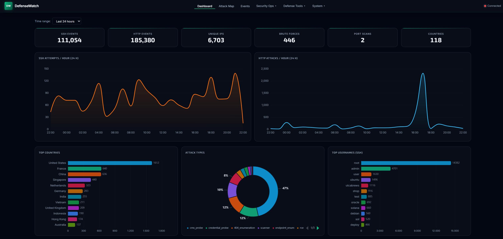
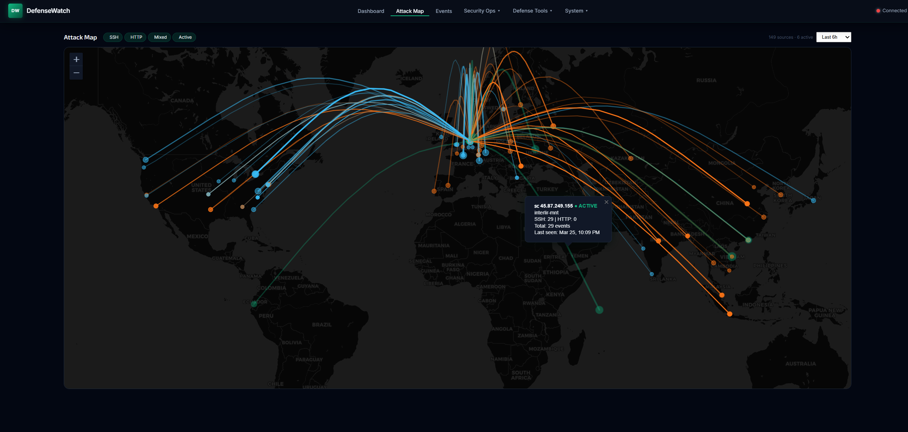
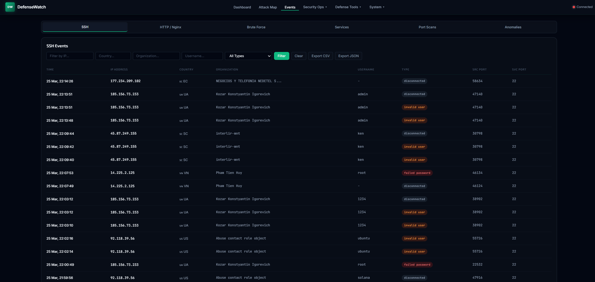
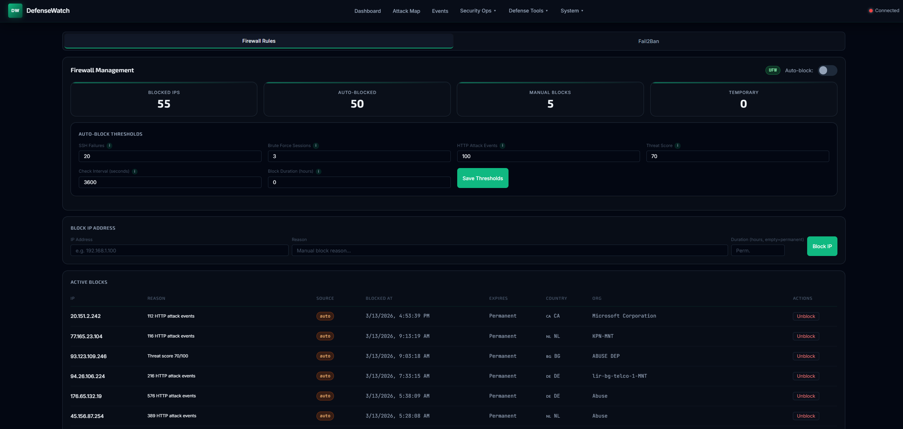

# DefenseWatch

> A Host Intrusion Detection System (HIDS) for real-time SSH and HTTP log monitoring, threat detection, and automated response — with a live web dashboard.


---

## Screenshots

<table>
  <tr>
    <td><strong>Dashboard</strong></td>
    <td><strong>Attack Map</strong></td>
  </tr>
  <tr>
    <td></td>
    <td></td>
  </tr>
  <tr>
    <td><strong>SSH Events</strong></td>
    <td><strong>Firewall Management</strong></td>
  </tr>
  <tr>
    <td></td>
    <td></td>
  </tr>
</table>

---

## Features

| Category | Details |
|----------|---------|
| **Log Monitoring** | Real-time SSH (`auth.log`) and Nginx/Apache access log watching via inotify/polling with log rotation support |
| **Attack Detection** | SSH brute force, HTTP attacks (SQLi, XSS, path traversal), cross-service port scan detection |
| **IP Enrichment** | GeoIP (MaxMind + ip-api.com fallback), reverse DNS, WHOIS, AbuseIPDB, AlienVault OTX |
| **Threat Scoring** | Composite risk scores based on brute force history, attack patterns, scan behavior, and threat intel |
| **Live Dashboard** | Vanilla JS SPA with attack map (Leaflet), event tables, IP intelligence, and Chart.js charts |
| **WebSocket Feed** | Real-time event push to all connected browser clients |
| **Firewall Integration** | Auto-block via ufw/iptables with configurable thresholds and expiry rules |
| **Fail2Ban Integration** | View jails, ban/unban IPs, manage Fail2Ban configuration from the UI |
| **Vulnerability Scanning** | Nuclei-based scanning with vhost auto-detection and service profiling |
| **Incident Management** | Create, track, and link security incidents to detected events |
| **Notifications** | Telegram bot alerts and webhook support (Slack, Discord, etc.) with daily/weekly reports |
| **Anomaly Detection** | Baseline computation with hourly anomaly checks |
| **Data Retention** | Automatic cleanup of old events based on configurable retention period |

---

## Architecture

```
Log Files ──> Watchdog ──> Parsers ──> SQLite (WAL mode)
                                  ├──> WebSocket Broadcast ──> Browser Dashboard
                                  ├──> Enrichment Pipeline (GeoIP, rDNS, WHOIS)
                                  ├──> Threat Intel (AbuseIPDB, OTX)
                                  ├──> Port Scan Tracker
                                  ├──> Anomaly Detection
                                  ├──> Firewall Auto-Block
                                  └──> Notifications (Telegram, Webhooks)
```

**Stack:** Python 3.11+, FastAPI, SQLite (aiosqlite), Watchdog, vanilla JS, Tailwind CSS v4

---

## Requirements

| Requirement | Required | Notes |
|-------------|----------|-------|
| Python 3.11+ | Yes | Runtime |
| python3-venv | Yes | `sudo apt install python3-venv` |
| Log file read access | Yes | Add user to `adm` group (see below) |
| ufw or iptables | No | Required for firewall auto-blocking |
| Docker | No | Required for Nuclei vulnerability scanning |
| Fail2Ban | No | Required for Fail2Ban integration |
| GeoLite2-City.mmdb | No | Local GeoIP lookups — falls back to ip-api.com |

---

## Quick Start

### 1. Clone and Install

```bash
git clone https://github.com/H4XLabs/DefenseWatch.git
cd DefenseWatch
chmod +x setup.sh start.sh
./setup.sh
```

`setup.sh` will prompt for your sudo password once and then automatically handle all system-level permissions. Specifically, it will:

1. Validate Python 3.11+ and create a virtual environment
2. Install all Python dependencies
3. Create the `data/` directory for SQLite and GeoIP databases
4. Generate `config.yaml` and `.env` from templates
5. **Add your user to the `adm` group** so DefenseWatch can read `/var/log/auth.log` and other system logs
6. **Write `/etc/sudoers.d/defensewatch`** so DefenseWatch can execute firewall commands (`nft`/`ufw`/`iptables`) without a password prompt — required for the auto-block feature
7. **Add your user to the `docker` group** (if Docker is installed) for the Nuclei vulnerability scanner
8. Optionally install and enable a systemd service unit

Every `sudo` command run by the script is printed to the terminal before it executes so you can see exactly what is happening:

```
[sudo] usermod -aG adm [username]
[sudo] Writing /etc/sudoers.d/defensewatch: [username] ALL=(root) NOPASSWD: /usr/sbin/nft
[sudo] chmod 440 /etc/sudoers.d/defensewatch
[sudo] usermod -aG docker [username]
```

> **Note:** If you skip the sudo prompt, DefenseWatch will still start but firewall auto-blocking will be disabled and log files may not be readable until you grant access manually (see [Firewall Access](#firewall-access-passwordless-sudo) below).

For non-interactive installs (e.g., CI/CD):
```bash
./setup.sh --no-interactive
```

### 2. Configure

Edit `config.yaml` with your system-specific settings:

```bash
nano config.yaml
```

At minimum, set:
- `logs.ssh` — path to your SSH auth log (e.g., `/var/log/auth.log`)
- `logs.http` — path(s) to your Nginx/Apache access logs
- `host.name` — your server's hostname
- `host.latitude` / `host.longitude` — server coordinates for the attack map
- `firewall.whitelist` — trusted IP addresses to never block

Then edit `.env` to add API keys for enhanced features:

```bash
nano .env
```

### 3. Run

```bash
./start.sh            # Start (default)
./start.sh stop       # Stop
./start.sh restart    # Restart
./start.sh status     # Check if running
```

Open **http://127.0.0.1:9000** in your browser.

---

## Configuration

Configuration is split across two files:

- **`config.yaml`** — System settings (log paths, thresholds, host info, feature toggles). Git-ignored.
- **`.env`** — Secrets and API keys. Never committed.

Settings changed through the web dashboard are automatically persisted to the correct file.

### Environment Variables (`.env`)

| Variable | Description |
|----------|-------------|
| `DEFENSEWATCH_TELEGRAM_BOT_TOKEN` | Telegram bot token |
| `DEFENSEWATCH_TELEGRAM_CHAT_IDS` | Comma-separated Telegram chat IDs |
| `DEFENSEWATCH_WEBHOOK_URL` | Notification webhook URL (Slack, Discord, etc.) |
| `DEFENSEWATCH_REPORTS_WEBHOOK_URL` | Scheduled report webhook URL |
| `DEFENSEWATCH_ABUSEIPDB_API_KEY` | AbuseIPDB threat intel API key |
| `DEFENSEWATCH_OTX_API_KEY` | AlienVault OTX API key |
| `DEFENSEWATCH_SHODAN_API_KEY` | Shodan API key |
| `DEFENSEWATCH_VIRUSTOTAL_API_KEY` | VirusTotal API key |
| `DEFENSEWATCH_CENSYS_API_ID` | Censys API ID |
| `DEFENSEWATCH_CENSYS_API_SECRET` | Censys API secret |
| `DEFENSEWATCH_CORS_ORIGIN` | CORS allowed origin (default: `*`) |
| `DEFENSEWATCH_LOG_FORMAT` | Set to `json` for structured JSON logging |

### Config Sections (`config.yaml`)

| Section | Description |
|---------|-------------|
| `server` | Bind address and port (default: `127.0.0.1:9000`) |
| `logs` | Log file paths and service ports for SSH, HTTP, MySQL, PostgreSQL, mail, FTP |
| `detection` | Thresholds for brute force, HTTP scan, and port scan detection |
| `geoip` | MaxMind MMDB path and fallback API URL |
| `host` | Server display name and coordinates for the attack map |
| `database` | SQLite path, WAL mode toggle, retention period |
| `enrichment` | Queue size, worker count, WHOIS toggle |
| `firewall` | Auto-block thresholds, block duration, IP whitelist |
| `notifications` | Enabled flag, severity filter, event types |
| `telegram` | Enabled flag, report schedule, severity filter |
| `threat_intel` | Enabled flag, refresh interval |
| `nuclei` | Docker image, severity filter, rate limit |

### Log Entry Format

Log entries support plain paths or explicit port mappings:

```yaml
logs:
  ssh:
    - path: /var/log/auth.log
      port: 22
  http:
    - path: /var/log/nginx/access.log
      port: 443
    - path: /var/log/nginx/mysite.access.log
      port: 8080
```

Supported log types: `ssh`, `http`, `mysql`, `postgresql`, `mail`, `ftp`.

### Common Log Paths

| Service | Path |
|---------|------|
| SSH (Debian/Ubuntu) | `/var/log/auth.log` |
| SSH (RHEL/CentOS) | `/var/log/secure` |
| Nginx default | `/var/log/nginx/access.log` |
| Nginx vhosts | `grep -r "access_log" /etc/nginx/sites-enabled/` |
| MySQL | `/var/log/mysql/error.log` |
| PostgreSQL | `/var/log/postgresql/postgresql-*.log` |
| Mail | `/var/log/mail.log` |
| FTP | `/var/log/vsftpd.log` |

### Detection Tuning

```yaml
detection:
  ssh_brute_threshold: 5         # Failed attempts to trigger brute force alert
  ssh_brute_window_seconds: 300
  http_scan_threshold: 20        # Suspicious requests to trigger HTTP scan alert
  http_scan_window_seconds: 60
  portscan_threshold: 3          # Distinct ports hit to trigger port scan alert
  portscan_window_seconds: 300
```

### Firewall Auto-Block

```yaml
firewall:
  auto_block_enabled: true
  ssh_block_threshold: 20            # Failed SSH attempts before blocking
  brute_session_block_threshold: 3   # Brute force sessions before blocking
  http_block_threshold: 100          # HTTP attack events before blocking
  score_block_threshold: 70          # Threat score threshold for blocking
  auto_block_duration_hours: 0       # 0 = permanent
  check_interval_seconds: 300
  whitelist:
    - 127.0.0.1
    - ::1
```

---

## Running

### Development

```bash
source venv/bin/activate
uvicorn defensewatch.main:app --host 127.0.0.1 --port 9000 --reload
```

### Production (systemd)

The setup script generates and installs a systemd service with the correct working directory, user, and host/port from `config.yaml`:

```bash
./setup.sh
```

Manage the service:

```bash
sudo systemctl start defensewatch
sudo systemctl status defensewatch
sudo journalctl -u defensewatch -f
```

### Docker Compose

```bash
docker compose up -d
docker compose logs -f
```

The Docker setup mounts host log files read-only and persists data in `./data/`. Configure via environment variables in `docker-compose.yml` or a `.env` file.

---

## Optional Setup

### GeoLite2 (Local GeoIP)

Download `GeoLite2-City.mmdb` from [MaxMind](https://dev.maxmind.com/geoip/geolite2-free-geolocation-data) and place it at `data/GeoLite2-City.mmdb`. Without it, DefenseWatch falls back to ip-api.com.

### Firewall Access (Passwordless sudo)

DefenseWatch calls `sudo ufw`, `sudo nft`, or `sudo iptables` to block/unblock IPs. Without passwordless sudo, the Firewall tab will show *"Cannot execute firewall commands"*.

First, identify your firewall backend:

```bash
command -v ufw && echo ufw || command -v nft && echo nftables || command -v iptables && echo iptables
```

Then create a sudoers drop-in for the matching backend:

**nftables** (most common on modern Debian/Ubuntu):
```bash
echo "$USER ALL=(root) NOPASSWD: /usr/sbin/nft" | sudo tee /etc/sudoers.d/defensewatch
sudo chmod 440 /etc/sudoers.d/defensewatch
```

**ufw**:
```bash
echo "$USER ALL=(root) NOPASSWD: /usr/sbin/ufw" | sudo tee /etc/sudoers.d/defensewatch
sudo chmod 440 /etc/sudoers.d/defensewatch
```

**iptables**:
```bash
echo "$USER ALL=(root) NOPASSWD: /usr/sbin/iptables" | sudo tee /etc/sudoers.d/defensewatch
sudo chmod 440 /etc/sudoers.d/defensewatch
```

If you use multiple backends, you can include all three in one file:
```bash
sudo tee /etc/sudoers.d/defensewatch << EOF
$USER ALL=(root) NOPASSWD: /usr/sbin/nft
$USER ALL=(root) NOPASSWD: /usr/sbin/ufw
$USER ALL=(root) NOPASSWD: /usr/sbin/iptables
EOF
sudo chmod 440 /etc/sudoers.d/defensewatch
```

Verify with `sudo -n nft list ruleset` (should run without a password prompt).

### Docker (Nuclei Scanner)

```bash
sudo usermod -aG docker $USER
docker pull projectdiscovery/nuclei:latest
```

---

## API Reference

All endpoints are under `/api/`. WebSocket at `/ws/live`.

| Endpoint | Method | Description |
|----------|--------|-------------|
| `/api/health` | GET | Health check |
| `/api/events/ssh` | GET | SSH events (paginated, filterable) |
| `/api/events/http` | GET | HTTP events (paginated, filterable) |
| `/api/events/brute-force` | GET | Brute force sessions |
| `/api/stats/summary` | GET | Dashboard summary counts |
| `/api/stats/top-ips` | GET | Most active threat IPs with tags |
| `/api/ips/{ip}` | GET | Full IP detail (enrichment, timeline, threat score) |
| `/api/ips/{ip}/timeline` | GET | 24-hour activity timeline |
| `/api/map/data` | GET | Attack map GeoIP data |
| `/api/firewall/status` | GET | Firewall status and capabilities |
| `/api/firewall/blocked` | GET | All blocked IPs (DB + system rules) |
| `/api/firewall/block` | POST | Block an IP via ufw/iptables |
| `/api/firewall/unblock` | POST | Unblock an IP |
| `/api/firewall/auto-block` | PATCH | Update auto-block settings |
| `/api/fail2ban/status` | GET | Fail2Ban status and jails |
| `/api/fail2ban/ban` | POST | Ban an IP in a jail |
| `/api/fail2ban/unban` | POST | Unban an IP |
| `/api/incidents` | GET | List incidents |
| `/api/incidents` | POST | Create incident |
| `/api/incidents/{id}` | GET | Incident detail |
| `/api/incidents/{id}` | PATCH | Update incident |
| `/api/scanner/scans` | GET | List vulnerability scans |
| `/api/scanner/scan` | POST | Start a Nuclei scan |
| `/api/settings/status` | GET | Current settings |
| `/api/settings/general` | PATCH | Update general settings |
| `/api/settings/webhooks` | PATCH | Update webhook settings |
| `/api/settings/api-keys` | PATCH | Update API keys (persisted to `.env`) |
| `/api/settings/detection` | PATCH | Update detection thresholds |
| `/api/settings/services` | POST | Add a monitored service |
| `/api/settings/services` | DELETE | Remove a monitored service |
| `/api/telegram/status` | GET | Telegram bot status |
| `/api/telegram/settings` | PATCH | Update Telegram settings |
| `/api/telegram/test` | POST | Send a test Telegram message |
| `/api/telegram/report` | POST | Trigger an on-demand Telegram report |
| `/ws/live` | WS | Live event stream (SSH, HTTP, brute force, port scan, anomaly, firewall) |

---

## Project Structure

```
DefenseWatch/
├── config.yaml.example          # Configuration template
├── .env.example                 # Secrets template
├── setup.sh                     # Installation and validation script
├── start.sh                     # Start/stop/restart script (reads config.yaml)
├── defensewatch.service         # systemd unit file template
├── Dockerfile
├── docker-compose.yml
├── requirements.txt
├── data/                        # SQLite DB + GeoLite2 MMDB (git-ignored)
├── static/
│   ├── index.html
│   └── app.js
├── defensewatch/
│   ├── main.py                  # FastAPI app, lifespan, background tasks
│   ├── config.py                # Dataclass-based config loader + .env override
│   ├── database.py              # SQLite schema, migrations, retention cleanup
│   ├── broadcast.py             # WebSocket connection manager
│   ├── scoring.py               # Composite threat scoring
│   ├── notifications.py         # Webhook notifications
│   ├── telegram.py              # Telegram bot integration
│   ├── firewall.py              # ufw/iptables management + auto-block
│   ├── fail2ban.py              # Fail2Ban integration
│   ├── anomaly.py               # Anomaly detection + baseline computation
│   ├── reports.py               # Daily/weekly report generation
│   ├── parsers/
│   │   ├── ssh.py               # auth.log parser + brute force tracker
│   │   ├── http.py              # Nginx access log parser + attack detection
│   │   └── portscan.py          # Cross-service port scan tracker
│   ├── watchers/
│   │   ├── handlers.py          # Log file event handlers
│   │   └── manager.py           # Watchdog observer setup
│   ├── enrichment/
│   │   ├── geoip.py             # MaxMind MMDB + ip-api.com fallback
│   │   ├── pipeline.py          # Async enrichment workers
│   │   └── threat_intel.py      # AbuseIPDB + OTX integration
│   ├── scanner/
│   │   ├── nuclei.py            # Docker-based Nuclei scanner
│   │   ├── vhost_detect.py      # Nginx/Apache vhost detection
│   │   └── service_profiler.py  # Tech detection + Nuclei tag selection
│   └── api/
│       ├── router.py            # Route mounting + health endpoint
│       ├── events.py            # Event query endpoints
│       ├── stats.py             # Summary + top IPs
│       ├── ips.py               # IP detail + timeline
│       ├── map.py               # Attack map data
│       ├── ws.py                # WebSocket endpoint
│       ├── firewall.py          # Firewall management API
│       ├── fail2ban.py          # Fail2Ban management API
│       ├── incidents.py         # Incident CRUD API
│       ├── scanner.py           # Scan management API
│       ├── settings.py          # Settings persistence
│       └── telegram.py          # Telegram settings API
└── tests/
```

## License

Copyright (C) 2026 H4X Labs

This program is free software: you can redistribute it and/or modify it under the terms of the **GNU General Public License v3.0** as published by the Free Software Foundation.

This program is distributed in the hope that it will be useful, but WITHOUT ANY WARRANTY; without even the implied warranty of MERCHANTABILITY or FITNESS FOR A PARTICULAR PURPOSE. See the [GNU General Public License](https://www.gnu.org/licenses/gpl-3.0.html) for more details.
